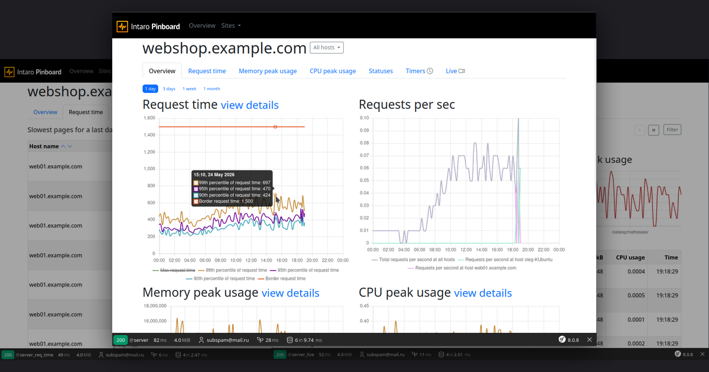

# Pinboard

[](https://github.com/intaro/pinboard/actions/workflows/ci.yml)
[](https://github.com/intaro/pinboard/actions/workflows/codeql.yml)
[](https://codecov.io/gh/intaro/pinboard)
[](https://github.com/intaro/pinboard/releases/latest)
[](https://hub.docker.com/r/xolegator/pinboard)
[](https://hub.docker.com/r/xolegator/pinboard)
[](composer.json)
[](https://symfony.com)
[](LICENSE)

A web admin panel for **Pinba** — a MySQL storage engine that collects real-time performance statistics from PHP applications.

Pinba was originally developed by [@tony2001](https://github.com/tony2001/pinba_engine) for MySQL ≤ 5.6 and is no longer maintained. This project ships with the [@XOlegator/pinba_engine](https://github.com/XOlegator/pinba_engine) fork, which adds support for MySQL 8.0 / 8.4 LTS and MariaDB 10.11 / 11.8 LTS. Pinboard itself is agnostic to which engine build you use.



## What is this?

**Pinba** is a system for passive performance monitoring of PHP sites:

1. **PHP extension** (`pinba`) — embedded in each PHP process, collects request timing, memory usage, CPU time, and custom timer groups. Sends a UDP packet to a Pinba server at the end of every request.
2. **Pinba engine** (`pinba_engine`) — a MySQL/MariaDB storage-engine plugin that receives those UDP packets and stores them as virtual tables. Acts as the "server" that listens on UDP port 30002.
3. **Pinboard** (this project) — a Symfony web app that reads data from the Pinba MySQL engine, aggregates it on a 15-minute schedule, and displays dashboards with request-time histograms, memory usage graphs, error rates, and slow-request logs.

```
PHP app  ──UDP──▶  MySQL + pinba_engine  ──SQL──▶  Pinboard web UI
(pinba ext)           (collects stats)              (aggregates & shows)
```

## Quick start (Docker Hub — recommended)

The fastest way to run the full stack. No build step needed.

**Prerequisites:** Docker Engine + Docker Compose v2.

```bash
# 1. Copy the example env file and fill in the required values
cp .env.public.example .env

# Edit .env — set APP_SECRET (openssl rand -hex 32) and passwords
nano .env

# 2. Start the stack
docker compose -f docker-compose.public.yml up -d

# 3. Create the first admin user (run once)
docker exec pinboard-web php bin/console add-user admin@example.com yourpassword ROLE_ADMIN
```

Open **http://localhost:8080** (or `PINBOARD_HTTP_PORT` from your `.env`).

The public image runs rootless by default as `www-data`; no host UID/GID mapping is needed for the standard production compose stack because application code is immutable inside the image and persistent state lives in Docker-managed volumes.

### Sending stats from your PHP app

Add to your PHP configuration (`php.ini` or pool config):

```ini
pinba.enabled = 1
pinba.server  = <docker-host-ip>:30002
; use PINBA_UDP_PORT from .env if you changed it from the default
```

Restart PHP-FPM and make a few requests on your site.

> **When will data appear?**
>
> Pinboard aggregates raw Pinba data on a 15-minute schedule. There is a two-stage warm-up:
>
> | Time after first request | What becomes visible |
> |---|---|
> | ~15 min (1 aggregation) | Server appears on the **main dashboard** (`/`) with basic request stats |
> | ~2.5 h (10 aggregations) | Server appears in the **navigation menu** on the left |
>
> The navigation menu requires at least 10 aggregation cycles to filter out one-off or test traffic.
> To see data immediately without waiting, trigger aggregation manually:
>
> ```bash
> docker exec pinboard-aggregate php bin/console aggregate
> ```
>
> Even after a manual run the navigation menu will remain empty until 10 cycles have accumulated. Use the main dashboard link directly in the meantime.

### Docker images used

| Image | Description |
|---|---|
| `xolegator/pinba-engine:8.4` | MySQL 8.4 LTS with Pinba storage engine plugin |
| `xolegator/pinboard:latest` | Pinboard web UI + aggregate worker (pin a release via `PINBOARD_TAG` in `.env`) |

Aggregated history and login sessions are stored in named Docker volumes and survive restarts and upgrades; see [data persistence & backups](docs/docker.md#data-persistence--backups).

The database image bundles the [XOlegator/pinba_engine](https://github.com/XOlegator/pinba_engine) plugin — a fork of the original [tony2001/pinba_engine](https://github.com/tony2001/pinba_engine) with support for MySQL 8.0 / 8.4 LTS and MariaDB 10.11 / 11.8 LTS added from a single source tree.

## Developer setup (run on host)

For local development without Docker.

**Requirements:** PHP ≥ 8.5, MySQL 8.x with `pinba_engine` plugin, Node.js 24 (`.nvmrc`), pnpm via corepack (`corepack enable` — the exact version comes from `packageManager` in `package.json`).

```bash
# PHP dependencies
composer install

# Frontend dependencies and build
pnpm install
pnpm build

# App configuration
cp .env .env.local
# Edit .env.local — set DB_HOST, DB_PORT, DB_NAME, DB_USER, DB_PASSWORD

# Database migrations
php bin/console doctrine:migrations:migrate

# Create first user
php bin/console add-user admin@example.com yourpassword ROLE_ADMIN

# Start a web server (e.g. Symfony CLI or nginx + php-fpm)
symfony serve
```

## Developer setup (Docker — dev stack)

For development with Docker, using source-mounted volumes and Xdebug support:

```bash
# Start dev stack (MySQL 8.4 LTS by default)
make up

# Or explicitly choose MySQL version:
make up84   # MySQL 8.4 LTS (same as default)
make up80   # MySQL 8.0 (for compatibility testing)

# Run migrations and create a user
make db_migrate
docker compose --env-file ./docker/.env -f ./docker/docker-compose.yml \
  exec -u www-data php-fpm php bin/console add-user admin@example.com yourpassword ROLE_ADMIN
```

See [docs/docker.md](docs/docker.md) for full details on both the dev stack and the public image stack.

## Console commands

| Command | Description |
|---|---|
| `php bin/console aggregate` | Run the aggregation pipeline (normally runs via cron every 15 min) |
| `php bin/console add-user <email> <password> [ROLE] [hosts_regexp]` | Create or update a user |
| `php bin/console users:migrate-file-to-db` | Migrate users from file-based auth to DB |
| `php bin/console users:migrate-db-to-file` | Migrate users from DB auth to file |
| `php bin/console register-crontab` | Print a crontab entry for the aggregation job |

## Configuration

Key environment variables (set in `.env.local` or as Docker env):

| Variable | Default | Description |
|---|---|---|
| `DB_HOST` | `127.0.0.1` | MySQL host |
| `DB_PORT` | `3306` | MySQL port |
| `DB_NAME` | `pinba` | Database name |
| `DB_USER` | — | Database user |
| `DB_PASSWORD` | — | Database password |
| `DB_SERVER_VERSION` | `8.4.0` | MySQL server version (for Doctrine) |
| `APP_AUTH_USER_SOURCE` | `file` | User storage: `file` or `db` |
| `APP_RECORDS_LIFETIME` | `P1M` | How long to keep raw data (ISO 8601 duration) |
| `APP_AGGREGATION_PERIOD` | `PT15M` | Aggregation window size |
| `APP_LOGGING_LONG_REQUEST_TIME_GLOBAL` | `1.5` | Slow request threshold (seconds) |
| `APP_NOTIFICATION_ENABLE` | `0` | Enable email notifications |

Full variable reference: [docs/configuration.md](docs/configuration.md)

## Related projects

- **[XOlegator/pinba_engine](https://github.com/XOlegator/pinba_engine)** — actively maintained port of the Pinba storage engine with support for MySQL 8.0 / 8.4 LTS and MariaDB 10.11 / 11.8 LTS from a single source tree. A fork of the original [tony2001/pinba_engine](https://github.com/tony2001/pinba_engine), which supported MySQL ≤ 5.6 and is no longer maintained (kept here for reference as the original project).
- **[XOlegator/pinba_extension](https://github.com/XOlegator/pinba_extension)** — actively maintained PHP extension that sends the UDP packets, supporting modern PHP 8.2–8.5. A fork of the original [tony2001/pinba_extension](https://github.com/tony2001/pinba_extension), which targeted older PHP versions and is no longer maintained (kept here for reference as the original project).

## Documentation

- [Configuration reference](docs/configuration.md)
- [Docker: quick-start & dev stack](docs/docker.md)
- [Deployment & operations](docs/deployment.md)
- [Testing](docs/testing.md)
- [Code standards](docs/standards.md)

## Upgrading from 1.x

If you have an existing Pinboard 1.x (Silex-based) installation:

1. Back up the database.
2. Check out this branch / the new release.
3. Run `composer install && pnpm install && pnpm build`.
4. Copy your old `config/parameters.yml` — file-based auth settings are preserved.
5. Run `php bin/console doctrine:migrations:migrate`.

See [docs/deployment.md](docs/deployment.md) for the full upgrade guide.

## License

MIT — see [LICENSE](LICENSE).
